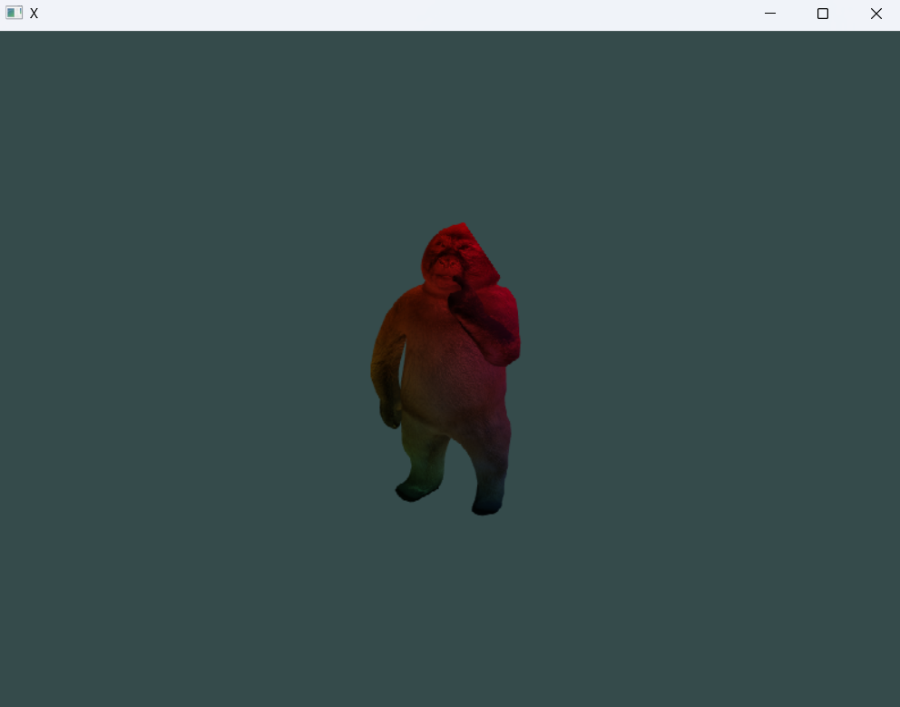

```glsl
// main.vert
#version 460 core

out vec3 color;
out vec2 texcoord;

layout(std430, binding = 0) buffer B0 {
    float tint[];
};

void main() {

    vec2 pos[] = {
        vec2(0, 0.5),
        vec2(-0.5, -0.5),
        vec2(0.5, -0.5),
    };

    vec2 uvs[] = {
        vec2(0.5, 1.0),
        vec2(0.0, 0.0),
        vec2(1.0, 0.0),
    };

    gl_Position = vec4(pos[gl_VertexID], 0, 1);
    color = vec3(tint[gl_VertexID*3], tint[gl_VertexID*3+1], tint[gl_VertexID*3+2]);
    texcoord = uvs[gl_VertexID];
}
```

```glsl
// main.frag
#version 460 core

in vec3 color;
in vec2 texcoord;
out vec4 o;

layout(binding = 0) uniform sampler2D t;

void main() {
    o = texture(t, texcoord) * vec4(color, 1.0);
}
```

```c
// main.c
#define GPUX_IMPL
#include "gpu/gpux.h"
#include "gpu/gpu.h"
#include "swl/swl.h"
#include <stdlib.h>

int main() {
    swl_CreateWindow("X", 800, 600);
    swl_GL_CreateContext(4, 6, 24, 8);
    IGPUDevice *device = GPU_GetDefaultDevice(&(device_request_t){
        .get_proc_address = swl_GL_GetProcAddress,
    });

    GPUX_Texture tex = GPUX_LoadTextureToMemory("test.png", 1);
    void *vert = GPUX_LoadShaderToMemory("main.vert");
    void *frag = GPUX_LoadShaderToMemory("main.frag");
    device->vtbl->NewPipeline(device, 0, 2, (void*[]){vert, frag});
    device->vtbl->CurrentPipeline(device, 0);

    device->vtbl->NewTexture(device, 0, 0, tex.width, tex.height, tex.heap_data);
    free(tex.heap_data);
    device->vtbl->BindTexture(device, 0, 0, 0);

    float tint[] = { 1,0,0, 0,1,0, 0,0,1 };
    device->vtbl->NewBuffer(device, 0, sizeof(tint), tint);
    device->vtbl->BindBuffer(device, 0, 0);

    for(;!swl_ShouldClose();) {
        if (swl_IsKeyPressed(27)) swl_SendQuitEvent();
        
        device->vtbl->Clear(device, 53, 75, 75);
        device->vtbl->Draw(device, 3, 3);

        swl_GL_SwapBuffers();
        swl_PollEvents();
        swl_PassScheduler();
    }

    swl_GL_DestroyContext();
    swl_CloseWindow();
    return 0;
}
```

